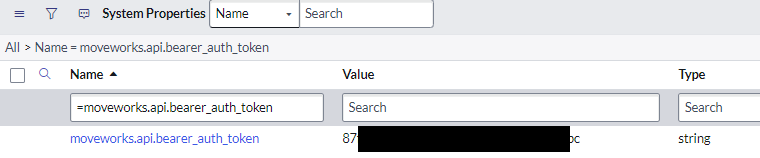
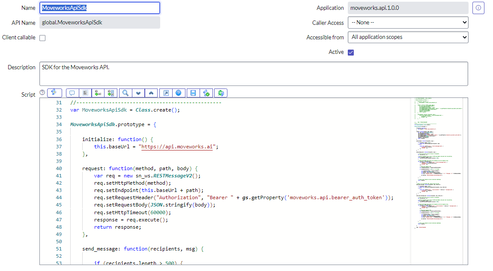
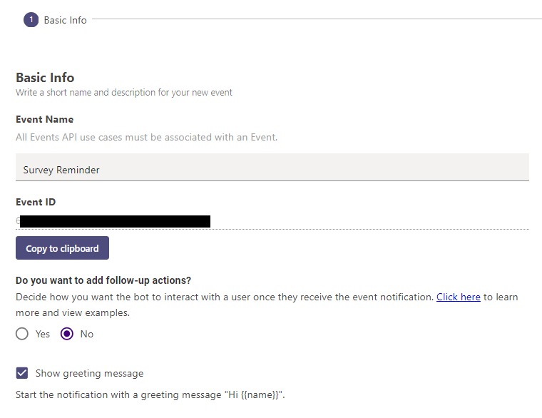
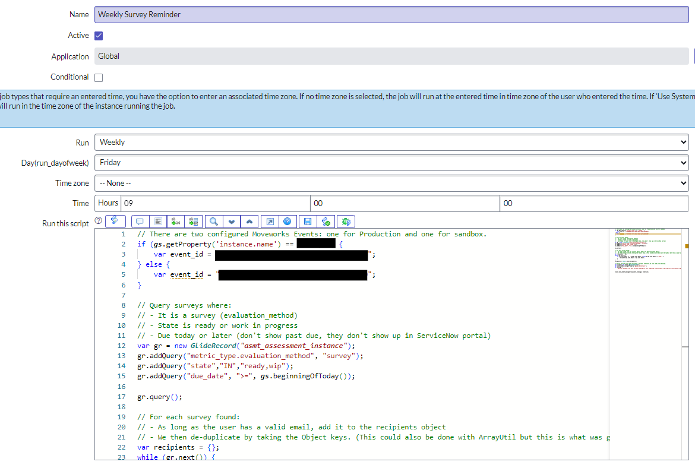

# Introduction
Using ServiceNow's Scheduled Jobs and Moveworks Creator Studio Events, we can send reminder notifications to users.

Some knowledge of ServiceNow and JavaScript, including understanding of Script Includes and Scheduled Script Executions, is required. You should have an **admin** role in ServiceNow. If you are not a ServiceNow admin, contact your ServiceNow development team to assist with this use case.

# What are we building?

[This purple chat](https://developer.moveworks.com/creator-studio/developer-tools/purple-chat-builder/?workspace=%7B%22title%22%3A%22My+Workspace%22%2C%22botSettings%22%3A%7B%7D%2C%22mocks%22%3A%5B%7B%22id%22%3A6167%2C%22title%22%3A%22ServiceNow+Survey%22%2C%22transcript%22%3A%7B%22settings%22%3A%7B%22colorStyle%22%3A%22LIGHT%22%2C%22startTime%22%3A%2211%3A43+AM%22%2C%22defaultPerson%22%3A%22GWEN%22%2C%22editable%22%3Atrue%7D%2C%22messages%22%3A%5B%7B%22from%22%3A%22BOT%22%2C%22text%22%3A%22As+a+reminder%2C+you+have+surveys+pending+for+your+completed+IT%2FHR+tickets.%5Cn%5Cn%F0%9F%91%89+Log+into+ServiceNow+%3Ca+href%3D%27google.com%27%3Ehere%3C%2Fa%3E+to+view+and+complete+your+open+IT+and+HR+surveys%2C+or+just+ask+for+%3Cb%3Emy+open+surveys%3C%2Fb%3E%21%22%7D%5D%7D%7D%5D%7D) shows the experience we are going to build.

**This use case is made up of:**

✨ **Triggers:** ServiceNow Scheduled Job and Script Include

🤲 **Slots:** None

🏃‍♂️ **Actions:** None - Link to ServiceNow Portal Survey Page

# Walkthrough

## System Property: Bearer Auth Token

If you have previously utilized the **moveworks.api.1.0.0** update set provided by Moveworks, you will already have installed a System Property called **moveworks.api.bearer_auth_token**.

You can find this in your System Properties (sys_properties) table.

The same token will be used when calling the Moveworks Event.

If you do not have this system property, create it now:

1. Navigate to your **System Properties** (sys_properties) table.
2. Create a new System Property using the information below:
* Name: moveworks.api.bearer_auth_token
* Description: Bearer Authentication Token required to interact with the Moveworks API
* Type: string
* Value: (this is supplied by your Moveworks Customer Success Team)



## ServiceNow Script Include for Event Calling

If you have previously utilized the **moveworks.api.1.0.0** update set provided by Moveworks, you will be aware of the Script Include **MoveworksApiSdk** utilized for the legacy Messaging service. This use case assumes you wish to extend the existing script include rather than creating a new one, so skip to Step 4 below.

If you do not have this Script Include, start here to create it.

**Step 1:** Navigate to your **Script Includes** (sys_script_include) table.

**Step 2:** Create a new Script Include called **MoveworksApiSdk**.

You will see that it has pre-populated with the following:

```javascript
var MoveworksApiSdk = Class.create();
MoveworksApiSdk.prototype = {
    initialize: function() {
    },

    type: 'MoveworksApiSdk'
};
```

**Step 3:** Add two functions to this Script Include.

```javascript
    initialize: function() {
        this.baseUrl = "https://api.moveworks.ai";
    },
```
This will set the variable `this.baseUrl` to be usable in the next function we will create.

```javascript
    request: function(method, path, body) {
        var req = new sn_ws.RESTMessageV2();
        req.setHttpMethod(method);
        req.setEndpoint(this.baseUrl + path);
        req.setRequestHeader("Authorization", "Bearer " + gs.getProperty('moveworks.api.bearer_auth_token'));
        req.setRequestBody(JSON.stringify(body));
        req.setHttpTimeout(60000);
        response = req.execute();
        return response;
    },
```
This function takes a method (post, in our case), path (which we will construct with our future Event ID), and body (which will contain the recipients and the message we will be sending our Event). It will utilize [RestMessageV2](https://developer.servicenow.com/dev.do#!/reference/api/washingtondc/server/c_RESTMessageV2API) to call the endpoint and return the response.

**Step 4:** We are now ready to create our new functions that utilize the [Events API](https://developer.moveworks.com/creator-studio/reference/rest-api/#operation/sendMessageForEvent). Because there is a known limit in which the Events API cannot handle more than 500 recipients, we will create two functions.

```javascript
    // Below is for the Events API. Event ID must be sent.
    send_event_message: function(recipients, msg, event_id) {

        if (recipients.length > 500) {
            return this.send_event_message_bulk(recipients, msg, event_id);
        } else {

            return this.request("post", "/rest/v1/events/" + event_id + "/messages/send", {
                "recipients": recipients,
                "message": msg
            });
        }
    },
```

Above is the function that will be called by any Scheduled Job or other future method you use to trigger Moveworks Events from ServiceNow. It takes an array of recipients, a string message, and the Moveworks Event ID. It will first check whether there are more than 500 items in the `recipients` array - if there are, it will pass the information to `this.send_event_message_bulk` (which we will create next). Otherwise, it will call `this.request` which was created above.

```javascript
    send_event_message_bulk: function(recipients, msg, event_id) {

        // This will be the array of arrays of recipients.
        var recListArray = [];

        // Splice recipients into arrays of 500 team members and push into recListArray.
        while (recipients.length > 0) {
            recListArray.push(recipients.splice(0, 500));
        }

        // Send the messages and collect the responses into the response array.
        for (recList in recListArray) {
            var response = (this.request("post", "/rest/v1/events/" + event_id + "/messages/send", {
                "recipients": recListArray[recList],
                "message": msg
            }));

            // Parse the response code.
            var httpResponseStatus = response.getStatusCode();

            if (httpResponseStatus != 204) { // If failed.

                var httpResponseBody = response.getBody();
                var parser = new JSONParser();
                var parsed = parser.parse(httpResponseBody);
                var log = "Response Code: " + httpResponseStatus + "\n" + "Messages: \n" + httpResponseBody;

                gs.log(log, "MoveworksApiSdk.send_message_bulk");

            }
        }

        // return last response (we must send back something)
        return response;

    },
```

This function performs the same as the previous, except that it splices the `recipients` array into groups of 500 users, and calls the Events API once for each group of up to 500 users.


Below is an image of how the functions slot into the script include prototype, for visual reference. (Note that `send_message` is legacy - you didn't miss anything. You will only have this function if you were modifying the Moveworks-provided Script Include from the **moveworks.api.1.0.0** Update Set.)



## Moveworks Creator Studio Event

Within Moveworks Creator Studio, create a new **Event**. You may wish to call it something like **ServiceNow Survey Reminder**.

At this time, we are not adding follow-up actions, and you may choose to show or hide the greeting message.

You will probably wish to restrict launch to only your own email at this time, for testing purposes.

Once you have saved the Event, click back into it. You will see an **Event ID**. Copy this - we will need it for future steps.



## Stop and Test

At this time, it's important to stop and test what we have built so far.

You should have:
* A Moveworks system property with your bearer auth token
* A Script Include in ServiceNow to send Events through
* A Moveworks Event ID

Create a **Fix Script** for testing purposes.

```javascript
var event_id = '<your Moveworks Event ID here>';

var recipients = ['<your email address here>'];
var message = 'Hello world!';

var client = new global.MoveworksApiSdk();
client.send_event_message(recipients, message, event_id);
```

Running this Fix Script will send a message from your Moveworks Chatbot to you with the message "Hello world!" If this has functioned as expected, you have successfully built a templated method to send Events calls to Moveworks via ServiceNow. Our Scheduled Job to send survey reminders, and any other Event-based notifications you may wish to send via ServiceNow, will function by calling our new Script Include.

## Scheduled Job

Navigate to the **Scheduled Jobs** (sysauto) table and create a new Scheduled Job. When prompted, select "Automatically run a script of your choosing". You will be taken to the New Record screen for a **Scheduled Script Execution**.

Give this scheduled job a name, such as "Weekly Survey Reminder to Moveworks", and set the schedule appropriately.

We will now begin creating our Scheduled Script Execution. Save often!

```javascript
var event_id = "<your Moveworks Event ID here>";
```
Start with your Moveworks Event ID.

```javascript
// Query surveys where:
// - It is a survey (evaluation_method)
// - State is ready or work in progress
// - Due today or later (don't show past due, they don't show up in ServiceNow portal)
var gr = new GlideRecord("asmt_assessment_instance");
gr.addQuery("metric_type.evaluation_method", "survey");
gr.addQuery("state","IN","ready,wip");
gr.addQuery("due_date", ">=", gs.beginningOfToday());

gr.query();
```
Above is an example of how you may wish to structure your survey query. You may wish to change the parameters here if you are only reminding people of a particular Survey Metric Type (field: metric_type) or for surveys triggered off a particular set of tables (field: trigger_table).

```javascript
// For each survey found:
// - As long as the user has a valid email, add it to the recipients object
// - We then de-duplicate by taking the Object keys.
var recipients = {};
while (gr.next()) {
    if (gr.user.email != '' && gr.user.email != null && gr.user.email != 'none') {
        recipients[gr.user.email] = gr.user.email;
    }
}
recipients = Object.keys(recipients);
```
This next block of code shown above checks each survey. For each, we are validating the user has a valid email, adding it to an object called `recipients`, and then setting `recipients` to the object keys. The reason we are doing this is for de-duplication purposes and was originally provided by Moveworks within their survey reminder example.

If, for whatever reason, your `user.email` field is not the field that is used to reconcile Moveworks accounts, please adjust the above code accordingly.

```javascript
// We are passing along the recipients, message, and event_id into send_event_message.
var instanceURL = gs.getProperty('glide.servlet.uri');
var message =
    '<p>As a reminder, you have surveys pending for your completed IT/HR tickets.</p>\n<p><br></p><p>:point_right: Log into ServiceNow <a href="'+ instanceURL + 'it?id=my_surveys">here</a> to view and complete your open IT and HR surveys, or just ask for <strong>my open surveys</strong>!';

var client = new global.MoveworksApiSdk();
client.send_event_message(recipients, message, event_id);
```

This final block of code first builds the message using the instanceURL system property (you should already have this out of box). It then calls our Script Include and the Event message is sent to the recipients.

**Important message notes:**
* If you do not have an associated query built to allow team members to query for their open surveys, remove the section of the message telling them that is an option.
* Your Portal suffix and survey page may not be the same as shown! Replace `it?id=my_surveys` with the actual verified link to a page your users can access!
* If you are sending other kinds of surveys than IT/HR tickets, adjust the wording appropriately.
* Depending on the messaging platform you use, you may need to tweak this message (modify/remove HTML etcetera). The above functions correctly for Microsoft Teams but has not been validated on other platforms.
* You can return to the Fix Script we created above and try sending this message to yourself while making adjustments, to see how it looks in the messaging platform your company uses.


Your Scheduled Job will end up looking something like the below. The below example has two Event IDs to distinguish between Production and Sandbox reminders for testing purposes.



## Stop and Test

Ensure your user account has one survey that meets the criteria for the Scheduled Job's query, and ensure your Moveworks Event is still restricted (you have not launched it to everyone).

Click "Execute Now" to execute your Scheduled Job immediately.

It's important to note at this time that there seems to be a configuration on the Moveworks end regarding whether Events will be sent at all, if the Recipients list contains users who are not part of the Selected Users for Launch. Please check with your Customer Success Team about this if you are testing this Scheduled Job and it is not being sent to you.

If you run into this issue and are unable to resolve it, you can move the entire code of your Scheduled Job into the Fix Script we created, adding an additional query of `gr.addQuery("user","<your sys_user.sys_id>");`, and then try running it. (This additional query will ensure the only surveys fetched are your own.)

## Final Steps

You're almost done!

Assuming you have been using an Update Set to capture your work in ServiceNow, you should have:
* A system property called **moveworks.api.bearer_auth_token** (only if you did not already have this)
* A Script Include called **MoveworksApiSdk**
* A Scheduled Job called something like **Weekly Survey Reminder to Moveworks** (this may not automatically be added to the Update Set - click "Add to Update Set")

Make sure you update your Moveworks Event to Launch to All Users, and migrate your Update Set to your production ServiceNow instance.

Post-migration, ensure the Scheduled Job is actually scheduled. You may need to flip its Active state off and on again to ensure it schedules itself.

# Congratulations

Your users will receive a scheduled reminder if they have pending surveys in ServiceNow!

You can now utilize the Script Include created to send all kinds of Events to your users via your Moveworks Chatbot. Think other Scheduled Jobs, Business Rules, Flow Actions... just make sure you keep track of your Recipients, Message, and Event ID for each!